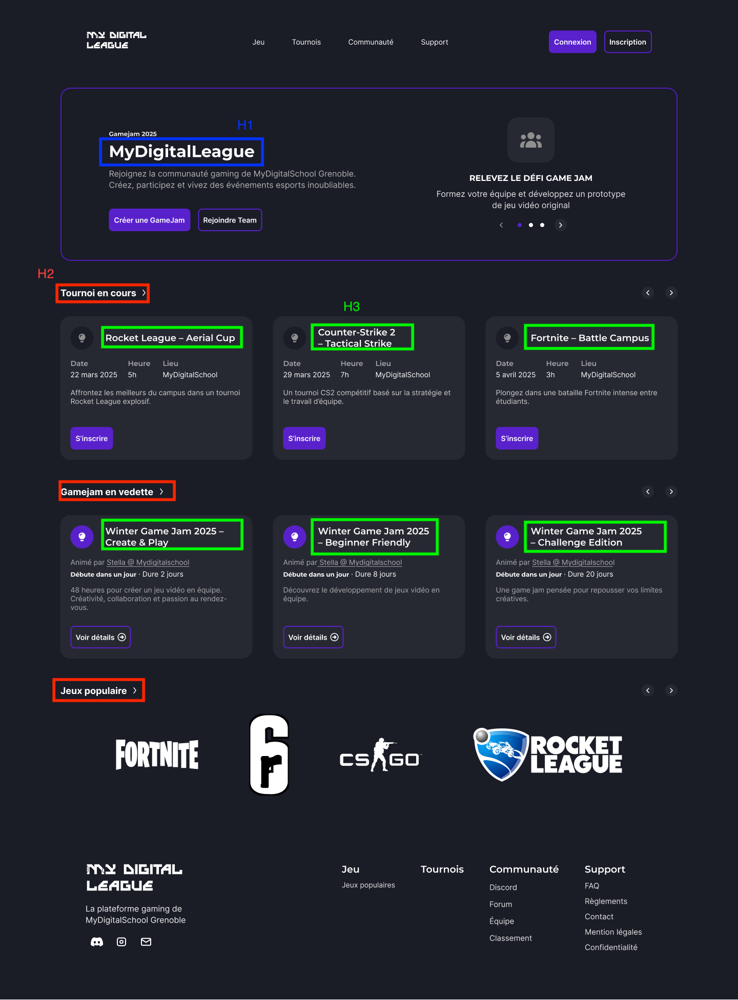
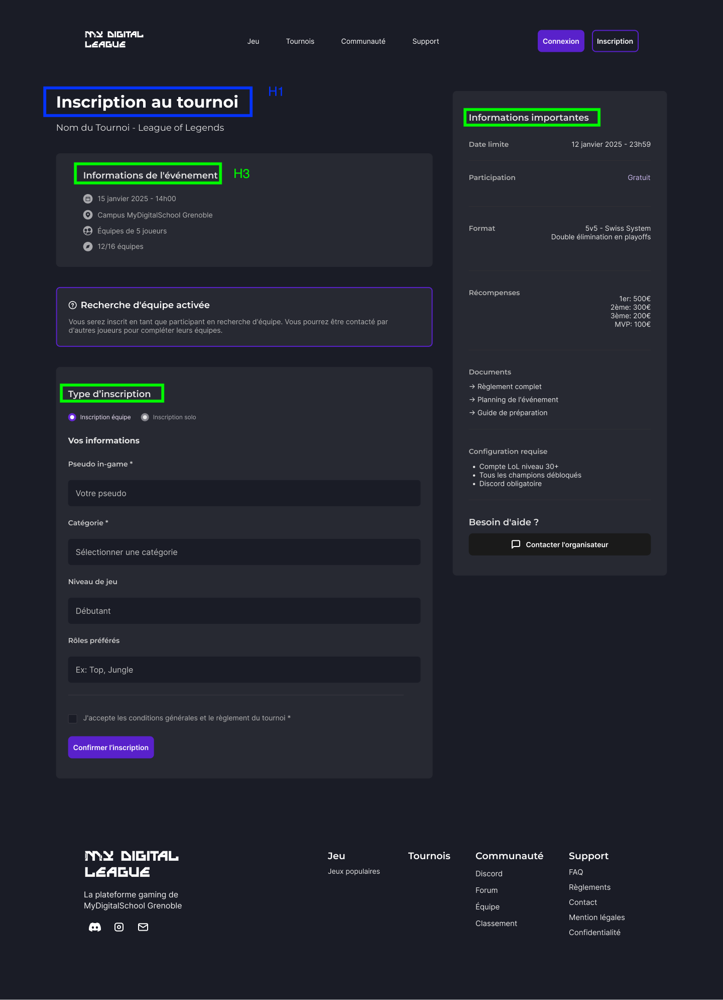

# Documentation des variables SCSS

## Principes généraux

- Toutes les variables de spacing, border-radius et font-size sont exprimées en `rem` pour garantir une échelle fluide et accessible.
- Les valeurs sont basées sur une division par 8 pour assurer une cohérence et une modularité dans tout le design système.

---

## Couleurs

| Variable | Valeur | Usage |
|----------|--------|-------|
| `$--color-bg-card-dark` | `#1a1c26` | Fond des cartes (thème sombre) |
| `$--color-bg-dark` | `#272932` | Fond principal (thème sombre) |
| `$--color-light` | `#ffffff` | Texte et éléments clairs |
| `$--color-text-dark` | `#a9a9ad` | Texte secondaire (thème sombre) |
| `$--color-icon-dark` | `#8f8f8f` | Icônes (thème sombre) |
| `$--color-primary` | `#5921cb` | Couleur principale |
| `$--color-primary-light` | `#e6def7` | Variante claire de la couleur principale |
| `$--color-secondary` | `#8c67f6` | Couleur secondaire |

---

## Tailles de police

| Variable | Valeur |
|----------|--------|
| `$--font-size-xs` | `1.2rem` |
| `$--font-size-sm` | `1.4rem` |
| `$--font-size-md` | `1.6rem` |
| `$--font-size-lg` | `2rem` |
| `$--font-size-xl` | `2.4rem` |

---

## Espacements (Spacing)

| Variable | Valeur |
|----------|--------|
| `$--spacing-xs` | `0.4rem` |
| `$--spacing-sm` | `0.8rem` |
| `$--spacing-md` | `1.6rem` |
| `$--spacing-lg` | `2.4rem` |
| `$--spacing-xl` | `3.2rem` |
| `$--spacing-xxl` | `4.8rem` |

**Cas d'usage :** Pour une maquette avec `20px`, utiliser `$--spacing-md`.

---

## Border Radius

| Variable | Valeur |
|----------|--------|
| `$--border-radius-sm` | `0.8rem` |
| `$--border-radius-md` | `1.6rem` |
| `$--border-radius-lg` | `2.4rem` |
| `$--border-radius-xl` | `3.2rem` |

---

## Breakpoints (Responsive)

| Variable | Valeur |
|----------|--------|
| `$--mobile` | `576px` |
| `$--tablet` | `768px` |
| `$--laptop` | `1200px` |

### Convention

- **Mobile first** : Utilisation de `min-width`.
- Pour les media queries en `max-width`, ajouter `-1px` pour éviter le chevauchement des breakpoints.

**Exemple :**

```scss
@media (max-width: $--tablet - 1px) {
  // Styles pour mobile uniquement
}
```

---

## Référence visuelle

Pour les styles de titre, se référer aux images ci-dessous :



